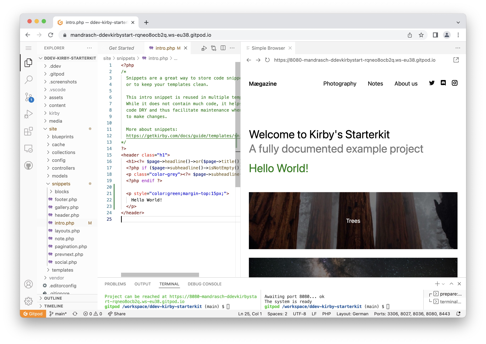

# DDEV Kirby Starterkit

[Kirby CMS](https://getkirby.com/) meets [DDEV](https://ddev.com/) & [Gitpod](https://gitpod.io/).

**Try it out in your browser:**

[](https://gitpod.io/#https://github.com/mandrasch/ddev-kirby-starterkit/)




**Local usage:**

Clone to your local laptop and run:

```
ddev start && ddev composer install && ddev launch
```

If you wan't to open the backend, use `ddev launch /panel`.

**About this starterkit**

See https://github.com/getkirby/starterkit for more information.

## How was this created?

**Kirby setup**

Based on ["Installing via composer"](https://getkirby.com/docs/cookbook/setup/composer#installing-composer)-docs.

```bash
ddev config --project-type=php
ddev ssh
composer create-project getkirby/starterkit starterkit-install-folder && \
    echo "Moving installation to root folder ..." && \
    mv starterkit-install-folder/README.md starterkit-install-folder/README_kirby.md && \
    cp -Rp starterkit-install-folder/. /var/www/html && \
    rm -rf starterkit-install-folder/
```

Since kirby does recognize DDEV local urls as remote sites, `/site/config/config.php` was edited:

```
  'panel' =>[
    'install' => true
  ]
```

See: https://getkirby.com/docs/reference/system/options/panel#allow-the-panel-to-be-installed-on-a-remote-server

**Gitpod & DDEV**

Gitpod DDEV integration was done with helpful tips by [@shaal](https://github.com/shaal). See `.gitpod.yml` and `.gitpod/`-folder.

## License

Kirby allows free local try outs, but for live sites purchasing a license is required.
[getkirby.com](https://getkirby.com) · [License agreement](https://getkirby.com/license)
